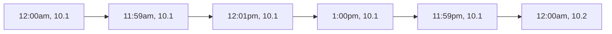

[TOC]

------

# Polysemy


- **abide**
  
  ```
  v. 等待
  v. 忍受
  v. 遵守
  ```
  
- **acute**
  
  ```
  adj. 敏锐的，有洞察力的 keen
  adj. 严重的
  adj. 强烈的，急性的, severe, intense
  ```
  
- **belie**
  
  ```
  be- 加强前缀
  v. 证明...错误  belie his testimony（证明它的证词错误）
  v. 掩饰
  v. 与...不符  her hobbies belie her powerful position(爱好与地位不符)
  ```
  
- **commit**

  ```
  v. 承诺
  v. 交付
  ```
  
- **compound**

  ```
  n. 混合物
  v. 混合
  v. 加剧，恶化
  ```
  
- **concrete**

  ```
  n. 水泥
  adj. 具体的
  ```

- **confound**

  ```
  v. 使困惑
  v. 证明...有误
  ```
  
- **counter**

  ```
  n. 柜台
  v. 反驳
  ```

- **discharge**

  ```
  v. 释放
  v. 履行（职责）
  v. 解雇
  ```

- **economy**

  ```
  n. 经济
  n. 节约
  adj. 节约的
  ```
  
- **elusive**

  ```
  adj. 回避的，逃避的
  adj. 含糊其辞的
  ```
  
- **emulate**

  ```
  v. 模仿
  v. 努力赶超
  ```

- **exploit**

  ```
  v. 开发利用
  v. 剥削
  n. 英勇行为
  ```
  
- **fashion**

  ```
  n. 时尚
  n. 方式
  v. 制作
  ```

- **frivolous**

  ```
  adj. 不重要的
  adj. 轻佻的 frivolous coquette(轻佻的荡妇)
  ```

- **gravity**

  ```
  n. 严肃庄重
  n. 地心引力
  ```

- **instrumental**

  ```
  adj. 乐器的
  adj. 有益的
  ```

- **integrity**

  ```
  n. 完整  integral完整的
  n. 正直
  ```

- **involved**

  ```
  adj. 难懂的
  adj. 包含的
  ```
  
- **manner**

  ```
  n. 方式
  n. 态度
  n. 举止
  ```
  
- **meet**

  ```
  v. 见面
  v. 满足
  n. 会议
  adj. 适当的
  ```
  
- **murky**

   ```
   adj. 昏暗的
   adj. 难懂的
   ```

- **plausible**

  ```
  adj. 合理的可信的
  adj. 似是而非的  plausible talk 花言巧语
  ```

- **prompt**

  ```
  v. 促使，推动
  n. 提示
  adj. 迅捷的
  ```

- **qualify**

  ```
  v. 限定
  v. 使合格
  ```

- **relieve**

  ```
  n. 宽慰
  n. 浮雕
  ```

- **resolve**

  ```
  v. 解决
  n. 决心
  ```

- **succumb**

  ```
  v. 屈服
  v. 死亡	 ~ to cancer 死于癌症
  ```

- **secure**

  ```
  adj.安全的
  v. 	使安全
  v.	把...弄到手
  ```

- **shed**

  ```
  v. 脱落
  v. 投射，发光
  n. 小屋
  ```
  
- **stem**

  ```
  v. 阻止，抑制
  v. 来源于
  n. 主茎
  ```
  
- **strip**

  ```
  v.	剥去
  n.	连环画
  ```

- **stifle**

   ```
   v.	使窒息
   v. 	遏制
   n.	(四足动物的)膝
   ```

   

# Similar or analogous

| word1                                    | word2          |
| ---------------------------------------- | -------------- |
| violate                                  | violence       |
| abound                                   | about          |
| converge                                 | convert        |
| secret                                   | secrete        |
| forge                                    | forage         |
| deduce                                   | reduce         |
| asset                                    | assert         |
| surprise                                 | suppressed     |
| defer, deter, deduce                     |                |
| odd                                      | odds           |
| annul                                    | annual         |
| condemn                                  | condone        |
| heroin                                   | heroic         |
| comprehensive                            | comprehension  |
| abroad                                   | aboard         |
| confound                                 | profound       |
| refuse                                   | refute         |
| perilous                                 | parallel       |
| confer                                   | defer          |
| improvise                                | improvement    |
| eschew                                   | shrewd         |
| overt                                    | over           |
| circumstance, circumstantial, circumvent |                |
| competitive                              | compatible     |
| adapt                                    | adopt          |
| decent                                   | discern        |
| hostile                                  | hospitable     |
| distinguish v.                           | distinct  adj. |
| compound                                 | component      |
| journal                                  | journey        |
| radiant                                  | radius         |
| specious                                 | species        |
| reflection                               | refraction     |
| anonymous                                | antonym        |
| commend                                  | comment        |
| covert                                   | covet          |
| eclipse                                  | ellipse        |
| diagnose                                 | diagonal       |
| distinguish                              | extinguish     |
| heterodox                                | orthodox       |
| scarce                                   | scare          |
| sever                                    | server         |
| disinterested                            | disinterest    |


# Math

## Math Term

| Term                                          | Chinese                                  | Equation            |
| --------------------------------------------- | ---------------------------------------- | ------------------- |
| **Noun**                                      |                                          |                     |
| scratch paper                                 | 草稿纸                                   |                     |
| odd number                                    | 奇数                                     |                     |
| even number                                   | 偶数                                     |                     |
| remainder                                     | 余数                                     |                     |
| divisor                                       | 因子                                     |                     |
| factor                                        | 因子                                     |                     |
| factorization                                 | 因式分解                                 |                     |
| units(ones) digit, tens digit, hundreds digit | 个位、十位、百位...                      |                     |
| tenths, hundredths, thousandths               | 十分位(0.1)、百分位(0.01)、千分位(0.001) |                     |
| fraction, numerator, denominator              | 分数，分子，分母                         |                     |
| term                                          | 项                                       |                     |
| (order of) **magnitude**                      | 数量级                                   |                     |
| phase                                         | 相位                                     |                     |
| fraction                                      | 分数 (1/4)                               |                     |
| inequality                                    | 不等式                                   |                     |
| algebra                                       | 代数                                     |                     |
| matrices ```/'meɪtrɪsiːz/```                  | matrix的复数``` /'meɪtrɪks/```           |                     |
| axiom                                         | 公理                                     |                     |
| theorem                                       | 定理                                     |                     |
| law                                           | 定律                                     |                     |
| inflection                                    | 拐点                                     |                     |
| exponents                                     | 指数                                     |                     |
| number line                                   | 数轴                                     |                     |
| decimal representation                        | 十进制                                   |                     |
| intercept                                     | 截距                                     |                     |
| **reciprocal**                                | **倒数**                                 |                     |
| coefficient                                   | 系数                                     |                     |
|                                               |                                          |                     |
| **Operator**                                  | **运算**                                 |                     |
| multiply                                      | 乘                                       |                     |
| product                                       | 乘积                                     |                     |
| minus / **subtract**                          | 减                                       |                     |
| prime factor                                  | 质因子                                   |                     |
| derivative                                    | 导数                                     |                     |
| differentiate                                 | 求导，微分                               |                     |
|                                               |                                          |                     |
|                                               |                                          |                     |
| **Geometric**                                 | **几何**                                 |                     |
| line segment                                  | 线段                                     |                     |
| perimeter / circumference                     | 周长                                     |                     |
| plane                                         | 平面                                     |                     |
| radius                                        | 半径                                     |                     |
| diameter                                      | 直径                                     |                     |
| parallel                                      | 平行的                                   |                     |
| perpendicular                                 | 垂直的                                   |                     |
| tangent                                       | 相切的                                   |                     |
| intersect                                     | 相交                                     |                     |
| skew                                          | 斜交                                     |                     |
| inscribed                                     | 内接于                                   |                     |
| **congruent**                                 | **全等的**                               |                     |
| **triangles**                                 | **三角形**                               |                     |
| **isosceles**                                 | 等腰的                                   | ```/aɪ'sɒsɪliːz/``` |
| **equilateral**                               | 等边的                                   |                     |
| **right triangle**                            | **直角三角形**                           |                     |
| hypotenuse                                    | 斜边                                     |                     |
| isosceles right triangle                      | 等腰直角三角形                           |                     |
| quadrilateral                                 | 四边形                                   |                     |
| **trapezoid**                                 | **梯形**                                 |                     |
| isosceles trapezoid                           | 等腰梯形                                 |                     |
| the Pythagorean theorem                       | 勾股定理                                 |                     |
| slope                                         | 斜率，斜坡                               |                     |
| cylinder                                      | 柱状                                     |                     |
| cone                                          | 锥                                       | circle cone圆       |
| diagonal                                      | 对角的                                   |                     |
| adjacent                                      | 相邻的                                   |                     |
| vertex                                        | 顶点                                     | 复数vertices        |
|                                               |                                          |                     |
|                                               |                                          |                     |
| **STATISTICS**                                | 统计                                     |                     |
| **standard deviation**                        | **标准差**                               |                     |
| variance                                      | 方差                                     |                     |
| median                                        | 中位数                                   |                     |
| arithmetic mean                               | 算数平均值                               |                     |
| ratio                                         | 比例                                     |                     |
| proportion                                    | 比例                                     |                     |
| normal distribution                           | 正态分布                                 |                     |
| **stochastic**                                | 随机的[数]                               |                     |
| estimate                                      | 估计                                     |                     |
| expectation                                   | 期望                                     |                     |
| population                                    | 总体                                     |                     |
| sample                                        | 样本                                     |                     |
|                                               |                                          |                     |
| **other**                                     |                                          |                     |
| constant                                      | 不变的                                   |                     |
| in checking account                           | 支票账户                                 |                     |
| expense                                       | 开支                                     |                     |
| asset                                         | 资产                                     |                     |
| down payment                                  | 首付                                     |                     |
| fraction                                      | 部分                                     |                     |
| mutually                                      | 互相地                                   |                     |
| revenue                                       | 收入，税收                               |                     |
| lawn                                          | 草地                                     |                     |
| simple annual interest                        | 年单利                                   |                     |
| compounded interest                           | 复利                                     |                     |
|                                               |                                          |                     |
|                                               |                                          |                     |

### Units

cent 美分　 penny 一美分硬币 　 nickel 5美分硬币　 dime 一角硬币　 dozen 打(12个)　 score 廿(20个)　 Centigrade 摄氏　 Fahrenheit 华氏　 quart 夸脱　 gallon 加仑(1 gallon = 4 quart)　 yard 码　 meter 米　 micron 微米　 inch 英寸　 foot 英尺　 minute 分(角度的度量单位，60分=1度)　 square [measure](http://top.zhan.com/cihui/ielts-measure.html) 平方单位制　 cubic meter 立方米　 pint 品脱(干量或液量的单位)

### Commercial terms

intercalary year(leap year) 闰年(366天)　 common year 平年(365天)　 depreciation 折旧　 down payment 直接付款　 discount 打折　 margin 利润 profit 利润　 interest 利息　 simple interest 单利　 compounded interest 复利　 dividend 红利　 decrease to 减少到　 decrease by 减少了　 increase to 增加到　 increase by 增加了　 denote 表示　 list price 标价　 markup 涨价　 per capita 每人　 ratio 比率　 retail price 零售价　 tie 打平

### Professional Expressions

- **twice as A as B:	A是B的两倍**
- **consecutive / successive  integers		连续整数**
- arithmetic  mean   算数平均值
- denote : f(x) denote the sum of ...、
- 离散 vs 连续:  discrete vs consecutive
- **无穷大vs无穷小:  infinite vs infinitesimal**
- 数量级: the order of magnitude of 2400 is 3
- **Formulas**

	- $x^2$  -- square
	- $x^{1/n}$  -- x to the power one over n
	- $y^{-10}$  -- y to the minus tenth power
	- $|x|$ -- absolute value of x
	- $\bar {x}$  -- x bar
	- $dy / dx$    -- the first derivative of y with respect to x
	- $d^ny / d^n x$   -- the nth derivative of y with respect to x
	- $\sqrt[3]{x}$   -- cube root of x  
	- $\sqrt[n]{x}$    -- nth root of x
	

### Polygons

- three: triangle
	- isosceles, equilateral, right, congruent
- four: quadrangle / quadrilateral
	- square, rectangle
	- trapezoid, parallelogram
- five:  pentagon
- six: hexagon
- seven: heptagon
- eight: octagon
- nine: nonagon
- ten: decagon
- eleven:  hendecagon 	
- twelve: dodecagon 
- thirteen: tridecagon
- fourteen: tetradecagon
- fifteen: pentadecagon


## Notes for exam

### Range (OG P7)

#### Arithmetic 算数

- properties and types of integers
	- **divisibility**
	- factorization
	- **prime numbers**
	- remainders
	- odd and even integers
- arithmetic operations
	- **exponents**
	- roots
- definitions
	- estimation
	- percent, ratio, rate
	- absolute value
	- the number line
	- decimal representation
	- sequences of numbers

#### Algebra

- operations with exponents

- factoring and simplifying algebraic expressions

	- relations
	- functions
	- equation
	- **inequalities**

- linear and **quadratic equations** and inequalities

	> quadratic equation	二次方程

- setting up equations to solve word problems

- coordinate geometry

- graphs

- **intercepts** and **slopes** of lines

#### Geometry

- **parallel lines**
- **perpendicular lines**
- circles
- triangles
	- **isosceles**
	- **equilateral**
- **quadrilaterals**
- **congruent** and similar figures
- 3D figures
- calculation
	- area
	- perimeter / circumference
	- volume
	- **the Pythagorean theorem**
	- angle measurement in degree

#### Data analysis

- descriptive statistics

	- mean
	- median
	- **mode**
	- range
	- standard deviation
	- **interquartile range**
	- **quartile**
	- percentile
- graphs

	- line graph
	- bar graph
	- circle graph
	- boxplots
	- **scatterplots**
	- frequency distribution
- elementary probability

	- random event
	- compound events
- random variable and probability distribution
	
	- normal distribution
	
		> $<\pm1\sigma$ -- 68%
		>
		> $<\pm2\sigma$ -- 96%
- calculation method
	- **combination**
	- **permutation**
	- Venn diagram

**No trigonometry or calculus.**

> trigonometry 三角学
>
> calculus	微积分


### Steps

1. Understand the question

2. Carry out strategy

	> 分别写出A和B的值

3. Check
	  1. Have you answered **all** the questions?
	  2. Is your answer **reasonable**?
	  3. Computational mistake?

### Strategies

1. Translate from Words to an Arithmetic or Algebraic Representation

2. Translate from Words to a Figure or Diagram

3. Translate from an Algebraic to a Graphical representation

4. Translate from a Figure to an Arithmetic or Algebraic representation

5. Simplify an representation

6. Add to a Geometric Figure

7. Find a pattern

	> 对于含有n，找不到直接解的，试着从1开始试试找规律 ($(m=10^{32}+2) \% 11 = r$那题)

8. Search for a **Mathematical Relationship**

9. Estimate

10. **Trial and error**

	> 有remainder的题，很多都是试或者pattern
	>
	> 试出来有不同结果的就可以选D了

11. **Divide into Cases**

12. Adapt solutions to related problems

13. Determine whether a conclusion follows from the information given

14. Determine what additional information is sufficient to solve a problem


### Traps

**number of  ==> 数量**

> value of	数值
>
> volume	体积


**读清楚图表的标题！**


**m选n问题的表达**

> $C^n_m$ ==> $  \left( \begin{matrix} m  \\  n \end{matrix}  \right) $


**关于圆、多边形，看清楚是area，还是perimeter，还是leg**

> the area of circle W is 16pi and that of Z is 4pi. what is $\frac{C_W}{C_Z}$  -->  2/1


**分清 billion vs million**


**变量的取值范围特别注意分类讨论**

> 两个量比大小
>


> 大于0小于0
>
> 大于1小与1


**看清：**

​	**要的是>还是≥**

​	**要的是 what percent 还是 what percent greater**

​	**近似到多少 (percent, decimal)**  


**变量是作用在所有含有它的值上的，切莫断章取义**


**随机变量是否独立**

> 不独立的不能用概率相乘
>
> most possible possibility  ==>  greatest possibility


**韦恩图交叉部分要计算两次**【多花点时间，你错很多这个题】


**复利的计算**

> 6% compounded quarterly	2 years	quarterly每1/4年复一次
>
> ​	$1.015^8$ * deposit


**折扣的计算**

> successive discounts of 20% and 40% = ?
>
> ​	1 - (1 - 20%)(1 - 40%)


**等差数列公式**
$$
\frac{(首项+末项)项数}{2}
$$


### Time of a day

**看清楚时间！	noon, midnight, am, pm**

12 am表示半夜十二点，等于12 midnight；(ante meridiem, before midday 中午之前)

12 pm表示中午十二点，等于12 noon；(post meridiem, after midday 中午之后)




### Boxplot


```
怎么看boxplot箱线图？箱线图默认：数值从左到右是：从~小~到~大~的顺序排列：
① 上图的List的最左顶到头的竖线 = 最小值的所在位置，最右顶到头的竖线为Q4 = 最大值的所在位置。
② 长方形的箱子：最左的边为Q1的所在位置，中间的竖线为Q2 = 中位数的所在位置，最右的边为Q3的所在位置。
——
其中，Q1~Q4的含义为：
Q1：在第1个25%的位置上；
Q2：在第2个25%的位置上，即在50%的位置上 = 中位数；
Q3：在第3个25%的位置上，即在75%的位置上；
Q4：在第3个25%的位置上，即在100%的位置上 = 最大值。
——
③ 每个位置的的值 = 竖线向下延伸与数轴的交点的值。
④ interquartile range 四分位差，即四分位范围 = Q3值－Q1值。
⑤ The range of lis = 最大值-最小值。
```

### normal distribution

$$
P\{|x<\mu | < 1\sigma \} = 0.6826\\
P \{|x-\mu|< 2 \sigma\} = 0.9544\\
P \{|x-\mu|< 3 \sigma\} = 0.9974
$$

# Chemical Term

| Word        | Formula(Symbol) | Note                          |
| ----------- | --------------- | ----------------------------- |
| nitrogen    | N               |                               |
| oxygen      | O               |                               |
| aluminum    | Al              |                               |
| alumina     | Al2O3           | 氧化铝                        |
| bauxite     | 铝土矿          |                               |
| molecule    | 分子            |                               |
| ozone       | 臭氧            |                               |
| ammonia     | 氨              |                               |
| inert gas   | 惰性气体        |                               |
| refrigerant | 制冷剂          |                               |
| bronze      | 青铜            |                               |
| alloy       | 合金            |                               |
| crystalline | 晶体的          | crystalline structure晶体结构 |
| isotope     | 同位素          |                               |
| proton      | 质子            |                               |
| caffeine    | 咖啡因          |                               |
| distill     | 蒸馏，提取      |                               |
| erode       | 腐蚀            |                               |
| **dilute**  | **稀释**        |                               |
| precipitate | 析出物          |                               |
|             |                 |                               |


# Biological Term

| Word           | Chinese            | Note                            |
| -------------- | ------------------ | ------------------------------- |
| calories       | 卡路里             |                                 |
| protein        | 蛋白质             |                                 |
| cholesterol    | 胆固醇             |                                 |
| metabolism     | 新陈代谢           | metabolic(adj.)                 |
| molecule       | 分子               |                                 |
| photosynthesis | 光合作用n.         | synthesis n.合成  synthesize v. |
| pollen         | 花粉               | pollinate授粉                   |
| glucose        | 葡萄糖             |                                 |
| adrenaline     | 肾上腺素           |                                 |
| endocrine      | 内分泌的           |                                 |
| exocrine       | 外分泌的           |                                 |
| fungus         | 真菌               |                                 |
| immune         | 免疫               |                                 |
| larva          | 幼虫               |                                 |
| peptide        | 肽                 |                                 |
| gland          | 腺体               |                                 |
| cerebral       | 大脑的，理智的     |                                 |
| cortex         | 皮层               | cerebral cortex                 |
| mite           | 螨虫               |                                 |
| vaccine        | 疫苗               |                                 |
| avian flu      | 禽流感             |                                 |
| contagious     | 接触传染的         |                                 |
| jaw            | 下巴               | snap: sudden closing of the jaw |
| inherit        | 继承，遗传         |                                 |
| acoustic       | 听觉的             | acoustic nerve听觉神经          |
| tumor          | 肿瘤               |                                 |
| fauna          | 某一时期的动物群落 |                                 |
| cataract       | 白内障             |                                 |
| sperm          | 精子               |                                 |
| ovum           | 卵子               |                                 |
|                |                    |                                 |

## Animal and Plants

| Word    | Chinese | Note |
| ------- | ------- | ---- |
| aspen   | 白杨树  |      |
| oak     | 橡树    |      |
| conifer | 针叶树  |      |
| algae   | 藻类    |      |
| foliage | 叶子    |      |
|         |         |      |

# Geographical Term

| Word         | Chinese     | note                |
| ------------ | ----------- | ------------------- |
| terrestrial  | adj. 陆地的 |                     |
| topographic | 地形的 | |
| tropical     | 热带的      |                     |
| Atlantic     | 大西洋      |                     |
| arctic       | 北极的      |                     |
| antarctic    | 南极的      |                     |
| meridian | 子午线 | |
|  | 纬线 | |
|  |  | |
|                |             |                     |
| seismic      | 地震的      | seismology地震学    |
| Mount Everest(Qomolangma) | 珠穆朗玛峰 |  |
| Himalayas | 喜马拉雅山 |  |
| glacier | 冰川 |                     |
| cliff | 悬崖 | |
| crust | 地壳 | |
| realm        | 领域        | academic realm      |
| hydrologic   | 水文学      |                     |
| corona       | 日冕，光环  |                     |
| stratosphere | 平流层 |      |
| troposphere | 对流层 |      |
| hydrosphere | 水圈 | |
| lithosphere | 岩石圈 | |
| biosphere | 生物圈 | |
| celestial | 天上的 | celeste天蓝色 |
| arid | 干旱的 | |
| gregarious | 群居的 | |
| reconnaissance | 勘测 | |
| geomorphology | 地貌 | morph-形态的 |

### Astronomy

| Word              | Chinese | Remark             |
| ----------------- | ------- | ------------------ |
| celestial         | 天上的  | ```/sɪ'lestɪəl/``` |
| cosmic            | 宇宙的  |                    |
| meteorite(meteor) | 陨石    |                    |
| nebular           | 星云    |                    |
| comet             | 彗星    |                    |
| supernova         | 超新星  |                    |


#### Solar System

- **Mercury**```/'mə:kjuri/```

	smallest planet,

	*traveling*

- **Venus**

	*love*

- **Earth**

	*land*

	gods' mother

- **Mars**

	*war*

- **Asteroid belt**

- **Jupiter**

	Zeus(Grecian name), gods' father

- **Saturn**```/'sæt(ə)n/```

	*agriculture*

- **Uranus**

	27 satellites

- **Neptune**```/'neptju:n/```

	Poseidon,  *sea*

# Physics term

- Electron flow（Current）$I$

	- ampere  $A$
- Voltage  $U$

	- volt  $V$
- Resistance  $R$
	- ohm  $\Omega$
- power $P$
	- watt $W$
- work $W$
	- joule $J$ ```/dʒuːl/```
- 

| Word              | Chinese                | Remark |
| ----------------- | ---------------------- | ------ |
| photon            | 光子                   |        |
| evaporation       | 蒸发                   |        |
| moisture          | 水分                   |        |
| vapor             | 水蒸气```/ˈveipə/```   |        |
| humidity          | 湿度                   |        |
| Celsius degree    | 摄氏度```/'selsiəs/``` |        |
| Fahrenheit degree | 华氏度                 |        |
| Lumina | 流明 |        |
|  | | |
| diffraction       | 衍射                   |        |
| interference      | 干涉                   |        |
|                   |                        |        |
| thermal           | 热量的         | thermal energy 热能        |
| radiant           | 辐射的         | radiation辐射n.            |
| **infrared (IR)** | **红外的**     | **infrared ray 红外线**    |
| **ultraviolet**   | **紫外的**     | **ultraviolet ray 紫外线** |
| particle          | 质点，粒子     | wave-particle duality      |


# Other jargon

| Word          | Chinese        | note                      |
| ------------- | -------------- | ------------------------- |
| archaeology   | 考古学         | archaic古代的             |
| epistemology  | 认识论         |                           |
| anthropology  | 人类学         | anthro- 人类的            |
| semantics     | 语言学         |                           |
|               |                |                           |
| prefix        | 前缀           |                           |
| suffix        | 后缀           |                           |
|               |                |                           |
|               |                |                           |
|               |                |                           |
|               |                |                           |
| velocity      | 速度           |                           |
| lever         | 杠杆           |                           |
| transparent   | 透明的         |                           |
| bog           | 沼泽           |                           |
| Fahrenheit    | 华氏度         |                           |
| Centigrade    | 摄氏度         |                           |
| pejorative    | 贬义词，轻蔑语 |                           |
| antonym       | 反义词         |                           |
| synonym       | 同义词         |                           |
| compliment    | 赞美之词       |                           |
| monarchy      | 君主制         | -chy 后缀的  一般是 *制度 |
| autarchy      | 专制，独裁     |                           |
| hierarchy     | 等级制度       |                           |
| density       | 密度           | dense 浓密的              |
| concentration | 浓度           | concentrate 聚集          |
| sediment      | 沉积物         |                           |

# Synonyms

### Adjective 

- affirmative
  - salutary	有益的
  - advantageous
  - sanguine  积极的
  - salubrious 有益的
  - sanguine 乐观的
  - propitious 有利的，吉祥的
  - auspicious 吉祥的，有前途的
  - tonic 有益的
  - supportive
  	- espouse v.支持
  	- advocate  v.支持
  	- approbate v.支持
  
- negative
  - pessimistic	悲观的
  - passive 消极的
  - **adverse**  负面的
  - harmful
     - pernicious 
     - deleterious
  - opposite
     - antithetical
     - object (v.)
  - bad
     - egregious
  - wrong
     - errant (错误的)
     - erroneous
     - fallacious
     - absurd
     	- ridiculous
     	- ludicrous
     	- preposterous
     	- outlandish
  
- for description
   - apposite                贴切的
      - pertinent
      - appropriate
      - germane
      - felicitous
      - objective 客观的
      - opportune 适当的
   - improper
      - inapposite
   - exaggerated  夸张的
   - discrepant  不同的
   
- everywhere
  - **ubiquitous**
  - pervasive
  - universal
  - omnipresent
  
- necessary
   - required
   - requisite
   - compulsory
   - obligatory (必须的)
   - imperative (急需的)
   - indispensable
   - imperative (迫切的)
   
- important
  
   - obligatory (必要的，必修)
   - important (重要的)
   - pivotal
   
- minor

   - trivial
   - trifling
   - inconsequential
   - immaterial
   - petty
   - paltry

- long-standing
   - perennial (常年)
   - permanent (永久)
   - perpetual
   - durable
   - lasting
   - continuing
   - continual
   - immortal
   - immutable
   
- mannish
  
  - masculine
  
- hostile

   - adversarial
   - aggressive
   - belligerent
   - antagonistic
   - inimical
   - truculent
   
- economic
   - fiscal (会计的)
   - pecuniary (金钱的)  => impecunious 穷困   vs.    peculiar 特别的
   - monetary
   - financial
   
- fair 公平的
   - impartial
   - disinterested
   - dispassionate
   - detached
   - indifferent (公平，冷漠的)
   - even-handed
   
- tepid 冷漠的

   - bland
   - halfhearted
   - lukewarm
   - apathetic
   - indifferent (公平，冷漠)
   - offhand
   - disinterest (n. 冷漠)
   - unfeeling
   - nonchalant

- similar
   - alike
   - resemble
   - analogous
   - affinity (n. 吸引力，相似性，密切关系)
   - comparable
   - parallel
   - kindred (同类的)
   - affiliated (相关的)
   
- same
   - identical
   - corresponding
   - isotropic
   - isotropous
   - congruent
   - uniform
   
- good(nice, kind)
  
  - kind
  - benign
  - benevolent
  - perfect
  - consummate
  - genial
  
- easy-to-get-angry
  - choleric
  - irritable
  - peevish
  - fractious
  - irascible
  - prickly
  - testy
  - fiery
  - petulant
  - surly
  - snappish
  - cantankerous
  - restive
  
- hardworking 勤奋的
  - diligent
  - assiduous
  - industrious
  - laborious
  - painstaking
  
- **smart** 
  
  - bright (口，机灵)
  - wise (有智慧)
  - brilliant (才华出众)
  - intelligent (正式)
  - deft (灵巧的，机敏的)
  - apt
  - nimble
  - erudite (机敏)
  - perceptive (洞察力强)
  - acute (敏锐，洞察力强)
  - subtle (敏锐，敏感的)
  - shrewd (精明老练)
  - keen (敏锐的)
  - astute (精明)
  - prudent (精明谨慎的)
  - adroit (精明，熟练)
  - dexterous (熟练的)
  - crafty (贬，狡猾)
  - canny (精明狡猾)
  - artful (机灵的)
  - tactful (机智的)
  - wily (狡猾的)
  - sophisticate (世故老练的)
  - worldly-wise
  - (n.)acumen
  
- creative
   - ingenious (暗示创造发明才能)
   - originative (有创作力的)
   - adroit (熟练的，灵活的)  be adroit at ...
   
- excellent
   - salient
   - extraordinary
   - outstanding
   - prominent
   - distinguished
   - exceeding
   - exceptional
   - prodigious (异常的，惊人的)
   - surpassing
   - stunning 极好的
   - sterling
   - eminent (出名的)
   - terrific 极大的，了不起的
   - 
   
- difficult-to-understand
   - arcane
   - abstract
   - baffling
   - cryptic
   - esoteric
   - **convoluted**
   - involved
   - obscure
   - occult
   - impenetrable
   - enigmatic
   - recondite
   - elliptical (隐晦的)
   - enigmatic (神秘，难懂)
   - profound (深刻，深奥)
   - recondite (深奥)
   - hermetic (深奥，密封的)
   - obfuscated (混淆的)
   - murky (含糊不清)
   - equivocal (模棱两可)
   - evasive (含糊其辞的)
   - ambiguous (模糊不清模棱两可)
   - inscrutable (不可理解的，谜一样的)
   - unfathomable (不可理解的)
   - perplexing (令人困惑的)
   - tortuous (曲折冗长复杂的)
   - conundrum  n.(很难搞懂的问题)
   - riddle (n. 谜团)
   
- clear
   - lucid
   - intelligible
   - pellucid
   - explicit
   - unambiguous
   - limpid
   - comprehensible v.
   - articulate
   - enunciate
   - blunt (直言不讳的)
   
- different 不同的
   - disparate
   - dissimilar
   - discordant
   - discrepant
   - divergent
   - heterogeneous
   
- tedious
   - arid
   - bland
   - diffuse
   - dreary
   - dull
   - prolix
   - prosaic
   - longwinded
   - insipid (平淡无味的)
   - jejune
   - insipid
   - verbose
   - loquacious (喋喋不休的)
   
- mixed
   - heterogeneous
   - assorted
   - inhomogeneous
   - miscellaneous
   - motley
   
- missing-old-things
   - nostalgic 怀旧的
   - retrospective (回溯的)
   
- suspicious 可疑的 [prove](#prove)<a name="suspicious"></a>
   - skeptical
   - dubious
   - apocryphal
   
- recalcitrant 桀骜不驯的
   - pretentious	自命不凡的
   - haughty		傲慢的  (类比  pride)
   - pejorative	轻蔑语(n.)，轻蔑的(adj.)
   - contemptuous 鄙视的轻蔑的
   
- changeable 善变
   - mercurial
   - capricious
   - fickle
   - variable
   - skittish
   - mercurial
   - volatile
   - wayward (任性难以捉摸)
   
- consistent

   - constant
   - insistent
   - continual
   - unremitting
   - assiduous
   - dogged
   - persevere
   - persistent
   - relentless

- abnormal
  
   - aberrant
   
- plentiful, enough
   - abundant
   - ample 满足需要且有余
   - considerable
   - appreciable
   - respectable
   - opulent
   - sizable(sizeable)
   - profuse
   - hefty 大量，健壮
   - surfeit (n. 过多)
   
   - sufficient (正式)
   - adequate (数量上够)
   - decent
   - ample
   - affluent (丰富，富裕)
   
- inadequate

   - insufficient
   - deprived
   - bereft
   - devoid
   - deficient
   - depleted
   - scanty
   - scant
   - scarce
   - meager
   - exiguous
   - wanting
   
- abstemious	节制的	

   - abstinent
   
- continuous 连续的
   - successive
   - constant
   - persistent
   - continual
   
- obvious
   - obtrusive
   - apparent
   - evident
   - manifest
   - patent
   - plain
   - distinct
   - conspicuous
   
- respectful [respect](#respect)<a name=respectful></a>
   - deferential
   - complaisant
   - obedient
   - reverential
   - submissive
   
- harmful
   - deleterious
   - detrimental
   
- poisonous
   - toxic
   - noxious
   - pernicious
   - baneful
   - **deleterious**
   - **detrimental**

### Verb

- annul 使无效
  - neutralize
  - invalidate
  - negate
  - nullify
- blame
  - accuse (归罪， >blame)
  - condemn (谴责，司法)
  - scold (上对下的数落)
  - rebuke (上对下的责备)
  - denounce (= condemn)
  - deplore
  - animadvert
  - censure
  - **diatribe**
  - impugn (指责质疑)
  - opprobrium (谴责)
  - reproach (责备他人的粗心、自私等)
  - reprove (责骂)
  - reprimand (责难)
  - reprehend (斥责责备)
  - decry (公开反对，谴责)
  - admonish  (警告，责备，劝告)
  - castigate (严厉斥责)
  - lambaste (严厉斥责)
  - chide ```/tʃaɪd/```
  - indict (起诉控告)
- defame 诽谤
   - malign
   - slander
   - smirch
   - asperse
   - denigrate
   - calumniate
   - smear
- claim
  - insist
   - declare
   - allege
   - affirm
   - maintain
   - testify
   - assert
   - purport
- refute
  
   - refute (语气强) 驳斥
   - repulse 驳斥
   - confute 驳斥
   - contradict 反对，反驳
   - controvert 反驳
   - counter 反驳
   - oppose (温和的)反对
   - dispute 争吵 辩论
- refuse 拒绝
  
   - repudiate 拒绝，否认
   - deny 拒绝
   - reject 拒绝
   - decline (谢绝邀请)
   - rebuff
   - spurn
- prevent 阻止禁止
   - deter
   - inhibit
   - prohibit
   - block
   - bar
   - hinder
   - impede
   - obstruct
   - hamper
   - contain
   - occlude
   - restrict
   - restrain
   - confine
   - prevent
   - preclude
   - throttle
   - hedge
   - shackle
   - stymie
   - surmise
   - trammel
- discuss
   - negotiate (商谈)
   - confer (交换意见)  协商；授予
   - consult (咨询)
- damage
   - impair
   - compromise 折中妥协，危害
   - blight
   - mar
   - ruin
   - deteriorate
   - undercut
   - undermine
- reduce
   - dwindle
   - contract
   - abate
   - decline
   - diminish
   - wane
   - decrease
   - lessen
   - minify
   - wane
   - curtail (删减)
   	- truncate 
   	- prune
- end
  - break (非正式，休息)
  - rest
  - pause (暂停)
  	- respite (暂停，暂缓)
  - interval (间歇)
  - recess (正式，休息)
  - cease (正式，结束)
  - stop (终止)
  - quash (镇压，平息)
  - stagnate 停滞
  - standstill (n.停止,停顿)
- disappear, destroy
   - annihilate (消失，毁灭)
   - vanish (消失)
   - dissolve
   - mash
   - wreck
   - obliterate
   - pulverize
   - raze
   - put to rest
- ignore 忽略
   - omission (n.)
   - disregard
   - neglect
   - overlook
   - elide (发音的省略)
   - languish (被忽视；衰弱折磨)
- disdain (鄙视)
   - hate
   - detest
   - disparage (轻视)
   - n.
      - contempt
      - derision
      - disregard
      - mockery
   - adj.
      - pejorative
      - contemptuous
- respect  [respectful](#respectful) <a name=respect></a>
   - esteem
   - revere
   - admire
   - venerate
   - honour (美式honor)
   - regard (正式，中性)
   - venerate
   - deference(n.尊敬)
   - awe (n.敬畏)
   - honorific (adj.表示尊敬的)
   - obeisance (n.尊敬)
- praise
   - eulogize
   - extol
   - exalt
   - laud
   - encomium n.
- indicate, forecast 预测

   - presage
   - portend
   - foreshadow
   - bespeak
   - betoken
   - predict
   - anticipate
   - augury (占卜)
   - forebode (对不祥之事)
   - presentiment (n. 对不祥之事)
   - precognition (n.)
   - prophetic (adj.预言的)
   - prescient (adj. 预言的)
   - prognostic (adj. 预言的)
- absorb
   - incorporate
   - assimilate
   - integrate
   - merge
   - consolidate
   - imbibe
- cheat
   - beguile
   - deceive
   - deceit
   - victimize
   - misinform
   - mislead
   - trick
   - swindle
   - fraud
   - skullduggery (n. 舞弊)
   - duplicity (n.)
- pretend 掩饰 假装
   - dissemble
   - feign
   - belie (掩饰; 证明...错)
   - misrepresent
- implore
   - ask
   - beg
   - demand (命令)
   - require (要求）
   - request (请求)
   - implore (书，急切的情感)
   - supplicate (哀求)
   - entreat (恳求)
   - claim (公开提出的要求)
   - pray (祈祷)
- want
   - yearn (渴望)
   - desire
   - thirst (全力以求)
   - hanker
   - long
   - cherish
- improve
   - enhance
   - refine
   - ameliorate
   - boost
   - perfect (v.)
   - hone (磨砺，提升)
   - augment (v, n，增强，扩大)
   - ameliorate (改善,positive)
   - meliorate (通ameliorate)
   - amend (改善)
   - remedy (纠正[正式])
   - rectify (纠正[正式])
   - revise (修订)
   - mitigate (缓和)
   - moderate (缓和)
   - alleviate (缓和)
   - inhibit (减缓)
   - palliate (缓和)
- prove 证实  [suspicious](#suspicious) <a name='prove'></a>
   - corroborate
   - confirm
   - affirm
   - certify
   - correspond
   - corroborate
   - jibe with (与...一致)
- admit 承认
   - confess
   - concede (让步)
   - grant 授予
- interpose 干涉 介入
   - interference
   - intervention
- attract  吸引，诱惑
   - charm 
   - allure
   - captivate
   - fascinate
   - enchant
   - seduce
   - tempt
- dislike
   - hate
   - detest
   - disgust
   - loathe v. 厌恶    (loath=loth  adj.不情愿的)
   - anathema (n. 憎恶的事)
   - cloy 吃太饱(倒胃口)
   - irksome(adj. 令人讨厌的)
- infer

   - deduce
   - conclude
   - extrapolate
   - gather
   - judge
   - reason
   - conjecture
   - speculate
- compose 组成
   - comprise
   - consist of
   - constitute
- give up
   - rationale
   - yield (投降)
- circumvent
   - shun
   - eschew
   - evade
   - sidestep
   - skirt
   - circumvent
   - dodge
   - shy away

### Noun

- disaster
  - catastrophe (灾难)
  - cataclysm (突然降临的大灾难)
  - calamity (个人不幸, > disaster)
  - misfortune (由于外部造成的不幸)
  - holocaust (大屠杀)
  - tragedy (悲剧，惨案)
- opinion
   - proposition
   - statement
   - proposal
   - 
- calm
   - aplomb
   - composure
   - equanimity
- contradiction
   - paradox
   - dichotomy
   - opposite
   - incongruity (不协调的)
   - at odds with
   - ambivalence(矛盾心理)  ambivalent 犹豫不决的，矛盾的
- feature
   - hallmark
   - trait
   - attribute
   - property
   - peculiarity ( => peculiar 特别的)
   - character
- lie 谎言
   - mendacity
   - untruthfulness
   - prevarication  推诿搪塞
- trap 陷阱
   - snare
   - pitfall
   - hook
   - mesh
- fingers
   - thumb
   - index finger
   - middle finger
   - ring finger / third finger
   - little finger

### Conjunction

- Sometimes
   - between times
   - every once in a while
   - once in a while
   - now and then
   - once in a way
   - sporadic
- although
   - notwithstanding	尽管
   - albeit
   - even though
- however
   - rather

# Notes for Verbal

## Prefix

### **Numbers**

- half:  **demi-, hemi-, semi-**

	>  hemicycle	半圆
	>
	> semifinal, semiautomatic

- one: **mono-, uni**

	> monowheel	独轮
	>
	> unipolar	单极

- two: **ambi-, amphi, bi-, di-**

	> ambisexual	两性的
	>
	> amphibian	两栖的
	>
	> biyearly		两年一次的
	>
	> dioxide	二氧化物,		diode	二极管

- three: **tri-**

	> triangle	三角形,	 triode	三极管,	tripod	三脚架

- four: **quadri-, quadru-**

	> quadrangle	四边形
	>
	> quadruple	四倍的

- five: **penta-, quinque-, quinqui-, quinqua-**

	> pentagon	五边形(五角大楼),	pentagram	五角星

- six: **sex-, sexi-, hexa-**

	> hexagon	六边形
	>
	> internal hexagonal wrench	内六角扳手

- seven: **sept-, hepta-**

	> septennial	七年一度的,	September 九月(古罗马的七月)； 
	>
	> heptagon	七边形

- eight: **oct-, octa-, octo-**

	> octagon	八边形

- nine: **nona-, ennea-**

	> nonagon	九边形

- ten: **deci-, deca-**

	> decimal	十进制
	>
	> decade	十年，	decagon	十边形

- 百分之一(百): **centi-**

	> centimeter	厘米
	>
	> centipede	百足虫

- **kilo-**

- **milli-**

	> millennial	千年的

- **multi-**

- **poly-**


## Conclusions

### Tips

- 注意补充的部分，可能是两个 '-' 之间的，也可能是两个 ',' 之间的

- the passage **addresses which of the issues** related to ...  问的是以下哪个问题**有谈到**

	> the passage addresses which of the following issues related to Glass's use of popular elements in his classical compositions
	>
	> 这段话讨论了以下哪些问题与格拉斯在古典作品中使用流行元素有关

- 选项单独看，不要想选项之间的关系

### Conjunction

**nonetheless		还是(adv.)	**

> though ... , the book is nonetheless ...

**notwithstanding**	尽管

> despite: 书面用词，指不受某事或某种原因的阻碍，语气轻于in spite of。
> in spite of: 在这些词中语气最强，可与despite换用，口语或书面语中均可使用。
> notwithstanding: 语气最弱，仅表示一种障碍的存在。
>
> I love the boy notwithstanding this naughtiness.

**in that** 因为

> The book is good, *in that* it's well written, but I didn't actually enjoy reading it.

**rather ** 然而

> Rather, he is still single.

 **willy-nilly**	不管三七二十一，随意地，不情愿地

> It upsets Sheldon when she willy-nilly takes food from the containers.

**either or**	【取反】要么...要么..., 非此即彼

> either good or bad

**hence**	因此

> hence, ....

**thereby**	因此

> 

**whilst**  同时

> = at the meantime

**erstwhile**  之前的

### Double Negative

**it is** wrong / presumptuous / foolish   **to say that** ...

paradoxical / ironical /puzzling/ ...

far from... / instead of .../

hardly / seldom

 **nothing less than  不亚于，完全是** 


## Every-day notes

### 8.27

```
obscuring 模糊的
incompatible 不兼容的
sympathetic  同情的
interminable 无尽的
```

```
precarious 危险的  <=> secure 安全的
```

```markdown
fellow 		同事
reluctant to articulate	很勉强（不愿意）去清楚表达
conscience 	良心的
artistic posture	“艺术家”姿态
substantiate 证实  <=>  overlook 忽视  <=>  undermines 破坏
```

```
bungling	拙劣的工作
thwart		反对
```

```
obstacle	==	stymie		障碍物	
hindrance	阻力
snare		圈套
```

```
ascent		上升
attain		达到
prominence	声望
```

```
provoke discussion	引起讨论
```

```
The detective's conviction that there were few inept crimes in her district led her to impute some degree of ____ to every suspect she studied.

conviction	确信n.
inept		不恰当的(笨的)  inept crimes笨案件
impute		归咎于
acumen		聪明n.	✔
shrewdness	机灵n.	✔
deceti		欺骗
duplicity	表里不一
evasive		逃避的adj.
equivocate	用模棱两可的话隐瞒真相
```

```
The author presents the life of Grey with ____ unusual in a biographer: he is not even convinced that Grey was a good writer.

detachment	中立的		✔
```

```
amateur		业余的
diversity	多样化
monotony	千篇一律
refinement	改良（优雅动作）
economies of scale	规模经济
```

```
Because we assume the preeminence of natural design, nature can often beguile us.

preeminence	杰出n.
beguile		欺骗，使陶醉
```

```
marine		海生的  marine mammals海洋哺乳动物
discern		识别
```

```
blend		混合  blending of ideas 想法的融合
discipline	训练n. v.  学科
domain		领域，产业，域名
interwoven	交织   <= woven <= weave编织
```

```
She refused to ____ her responsibilities as an author ...

neglect		疏忽
shirk		逃避
```

**注意while 有  though 的意思**

```
... while some of these changes might be ___, many could be downright disruptive
此处 while A, B 的意思是：虽然A，但是B，可以理解为though

downright disruptive	彻底 颠覆的
catastrophic	灾难性的
calamitous		悲惨的
```

```
The footage of the documatary is seemed to be deliberately ____.

censor		删掉，审查
suppress	镇压（隐瞒）
```

```
He loathed the party, but is seemed ____ to say so publicly.

loath		勉强（不愿意） = loth
loathe		厌恶v. 极度不喜欢
tactless	不机智的  tact 机智老练n.
impolitic	失策的
```

```
pest		害虫
invading species	入侵生物
```

```
stringent	严格
procedure	流程
inspection	检查
```

### 8.28

```
etiquette	礼仪
manual		手册
waistcoat	马甲
```

```
high tissue concentration	高组织浓度
compound	混合物
resistance to infection		抗感染能力
exposure (n.)  <=  expose (v.)
mortality rate	死亡率
```

```
prose		散文  => narravite	记叙文
lucrative	盈利的，合算的
emerge		出现，显示
subvert		推翻
tragedy		惨案
heroic		英雄的
patriarch	主教
```

```
speculative	scenario	投机情节
periphery	外围的
offset		抵消，偏移
dense		浓厚的
stir		搅拌，挑拨离间
excessive	过多的，过分的
```

```
abandon		放弃
faction		小集团
presumptive	假定的
impartial	公平  (partial 局部的，不公平的)
stance of impartial	公平的立场
dispute		争端
```

```
range	=>	领域
composer	作曲家
pianist		钢琴家
conductor	指挥
dichotomise	对分
'reluctance' is being ascribed to sb. 认为...属于...
```

### 8.29

```
elitst	<-->	egalitarian
精英				平等主义者
```

**seemingly** 后半句是反义：...看似A, （实际上）B，A和B是反义的

```
The book's seemingly casually written, conversational style masks a shrewdly crafted.
```

```
aesthetic quality	美学质量
commercial	经济的、有利益的
polemical	争辩的(polemic反调)
```

```
impenetrable	费解的
```

```
reputation	名气
venal		唯利是图
impudent	厚颜无耻
corteous	有礼貌的，polite
```

```
nettle		惹怒, annoy
observation	观点
contemptuous鄙视的轻蔑的
```

```
elusive		深奥的，难懂的
circumstantial	旁证(详细的)
```

```
plastic		可塑的
malleable	可延展的
```

```
Each member of the journalistic pair served as ___ the other.
a check on		检查✔
a brake on		刹车✔
journalistic	新闻业的
advocate for	提倡
```

```
on slippery ground	没有把握的
=>	dubious	将信将疑的，不可靠的
```

```
glorious monument	光荣的纪念碑
They enfeeble the city by enabling the migration of city dwellers to the suburbs.
enfeeble	弱化
dweller		居民
suburb		郊区
```

```
xxx was ridiculed by them, so it has become a pejorative.
redicule	嘲笑
pejorative	轻蔑语(n.)，轻蔑的(adj.)
```

```
ill at ease	不安
ill at ease	不安
ill at ease	不安
aplomb		镇静(n.)
magnanimity	宽宏大量
clumsy		笨拙的
```

```
at odds with	认为...不妥
at odds with	认为...不妥
at odds with	认为...不妥
supersede		取代
citation		引用
methodical		有条不紊的
insight			洞察力
```

```
wanting		欠缺的
```

```
The dot's appearance of supplication/entreaty became increasingly irritating, his whines became more wheedling, his manner more imploring.
supplication	请求
entreaty		请求
irritating		让人生气的
whine			呜呜声
wheedle			用甜言蜜语哄骗
implore			乞求
```

```
democracy	民主政治
signpost	路标
```

```
millennium	千禧年
```

### 8.31

```
Hester is overshadowed by her younger and more attractive sister.
overshadow	使...黯然失色
```

```
hardly a debased kind <==>  paradigm
debased		降低
paradigm	模范
```

**<u>in that</u> 还能表示  因为！！！**

```
This approach is startling, in that she jettisoned the normally used devices.
approach	方法
startling	触目惊心
jettison	摈弃
in that 	因为
```

```
discomfit	挫败
infallibility	不可能错的(n.)
## remedial	补救的
```

### 9.03

```
dextral		右旋的
sinistral	左旋的
```

### 9.05

```
slander		诽谤
defame		中伤
calumny		诽谤
```

```
scandal		丑闻
be keen on	喜欢，渴望
be inclined to	倾向于
dispense with	免除，省掉
```

```
hodgepodge	大杂烩
identity theft	身份盗用
distinction	荣誉；区分
```

```
doctrinare	教条主义
mutable  -> immutable
```

```
haughty		傲慢的  (类比  pride)
caricature	讽刺(用漫画讽刺)
```

```
不合历史的:
	ahistorical
	anachronistic (过时的，时代错误的)
```

```
at the heel of	紧跟在...后面
irascible	易怒的
pugnacious	好斗的
```

```
erudite		博学之士
insular		孤立的，与世隔绝的
cosmopolitan	世界性的
imperturbable	泰然自若的
```

```
the ban begins to appear imminent.
imminent	迫近的
```

```
belie	证明...是错的
austere	简朴的
erode	腐蚀
```

### 9.06

```
chronicle	编年史		
+	ana-	错误的，分开的
=>	anachronistic	过时的，时代错误的
```

```
be central to	对...很重要
prevailing wisdom	流行的看法
referenda	公民投票
election	选举
```

````
peruse	考察研究
orthography	正写法（正确拼写）
fastidious	讲究的
pretentious	自命不凡的   vs	defiant	挑衅的
````

```
impediment	障碍	=>	impenetrable	不可穿越的
```

```
erstwhile	往昔  ==	past
```

```
rampant	猖獗
rampant in 	==	ubiquitous in	到处都有
```

```
wordly-wise	精于世故的
narcissistic	自恋的		<==>	self-flattery	自我拍马屁的
```

### 9.08

```
maize	==	corn 玉米
```

### 9.10

```
abstemious	节制的	==	abstinent	节制的，禁欲的

```

### 9.15

disinterested		客观的

### 9.26

marsh	沼泽

> synonym: marsh,  swamp, bog

sediment	沉积物

evaporate	蒸发

identical  vs   identify

advocate	主张

reassessment	= re+assess+ment

in turn	反过来

in time	最终


particle	小颗粒

susceptible	易受影响的

disperse	消散、驱散

impact	冲撞，冲击

drift	漂移

crater	火山口

ensure	确保安全

blast	爆炸

A **is called into question** by B		A被B质疑

### 9.27

composer	作家

revive	复兴		renaissance	文艺复兴


obscure 	掩盖，模糊的

dispute	争论

underscore = underline

sparse	稀少的```/spɑːs/```	<-->	spares	备件

sparseness	疏忽

superficial	肤浅的


vain and prone to violence	对暴力的无力抵抗

eminence	名声

tumultuous	混乱的，无秩序的


percept	察觉	=>	perceptible	可察觉的	=>	imperceptibly	不知不觉地


pioneer	开荒者

orthodox = conventional	常规的

trifle	闲聊(浪费时间的)	=>	trifling	微不足道的，轻浮的

eccentric	怪异的


counterproductive	适得其反

> counter-	反


technocrat	科技主义者		democrat	民主统治

> -crat	xx统治
>
> democrat = demo人民 + crat统治
>
> autocrat	独裁
>
> bureaucrat	财阀统治
>
> mobocrat	暴民统治

**exacerbate	使...恶化**


ill-timed	生不逢时

**fatality	死亡n.**

dilute	稀释

proliferate	繁殖，增生

supplant	替代

pest	害虫

rampant	疯狂的

dairy	乳制品，奶业 ```/'deərɪ/```

pasture	放牧，吃草


catering	餐饮服务	<-->	ordinary restaurant

banquet	宴会

stringent	严格的

subsequent	之后的


circulation	循环，(报纸)发行量


revenue	税收	$\sum tax = revenue$


offset	抵消、补偿

**excessive	过分的，严重的**

intact	完整的


**illuminate	阐释**

scholar	学者

classic	古希腊、罗马文学

**deliberation	深思熟虑**

> deliberate	故意的；深思熟虑的；从容不迫的；仔细考虑v.

contemporary	当代的、同龄人

**impart	传授**

association

assertion

**context	上下文**

extemporaneous	即兴的 	improvise	临时制作v.

conjunction	结合


### 9.29

puny	微不足道的```/'pjuːnɪ/```

goose bump	鸡皮疙瘩

flush	脸红

regulate	调节

thermo-	热

> thermoregulation	热调节系统
>
> thermoalloy	热敏合金

distinguish	区别v.	==>	**distinguished	卓越的**

prominent	卓越的

intellectual	知识分子n.	理智的adj.

ammunition	弹药，军火

obsolete	陈旧的```/'ɒbsəliːt/```

exemplify	证实	<==	example

**composite	综合的，合成的**

rival	竞争者

constitute	建立

**relic	遗产**

philosophy	哲学

espousal	拥护	```/ɪ'spaʊz(ə)l/```

**liberty	自由**


supernovas	超新星

cosmic ray

**radiation**

quasar

conspicuous	显眼的

collide	冲突，碰撞

photon	光子

pervasive = ubiquitous

odds	机率

favor	喜爱

retain	保持

**in the course of	在...过程中**


pioneer	开荒者

pastime	娱乐消遣

noble	贵族，高端的

hasten	加速

overdue	迟到

feminist	女权主义者

affirm	断言

advancement	提拔晋升

**<u>虚拟语气的倒装</u>**

> its impact would have been modest **<u>had it</u>** not attracted a greater ...
>
> 如果没有吸引更多的..., 它的影响力也只能说是平凡...


sustain	持续	==>	sustainable	可持续发展的

boast	自吹自擂


### 10.02

pioneer	开拓者，先驱

noble	贵族的

elaborate	详细说明

composer	vs	compound


court	奉承

woo	向...示好

propagandize	宣传

be susceptible to	易受影响的


### 10.03

rival	竞争对手

**we have yet to complete	还未完成**

trivial	琐碎的

daunting	令人却步的


deception	骗术	deceptive	误导的

exploit	开发，利用，剥削


stylistic conventions	文体惯例(八股文)


**anything but = not	==>	anything but ineffective = effective**


pathetic	可悲的


era	年代

acquisitive	贪婪的

intimate	亲密的；私人的；精通的；[婉]有性关系的


elegant = polish	优雅的，精良的

exact a toll	承担代价


excise	切除；消费税

erode	侵蚀	<==>	rust	生锈

augment	=	consolidate	扩大


textile	纺织品

glaring	耀眼的

omission	忽略

outnumber	数量上超过v.

wage	薪水

indices	pl.<==	index

suppress	压制，镇压

**and the like	等等(etc.)**

rule out	排除


indict	起诉

controversial	引起争议的


moisture	

precipitate	析出物，沉淀物

**evaporation of moisture	降水的蒸发**


deposit	保证金，存款


retrofit	翻新

aesthetic	审美的


cosmic	宇宙的

disseminate	 传播

vast	大量的


perceptual = sensing	感知的

make out	≈	recognize	≈	identify


### 10.04

tempo	

discrete			分离的

dubious			可疑的

ample			大量的

**chronological			按时间顺序的**

> chrono- 表示时间
>
> chronometer	精密时钟
>
> chronology	年代学
>
> anachronistic 		过时的

paucity			缺乏

stem			主干

activist			激进分子

prodigious			异常的，惊人的，巨大的

suffrage				选举权，赞成票n.

> universal suffrage 	普选权

belie			掩饰；与…不符；使失望；证明…虚假错误

temperance

**on behalf of			代表，为了**

inimical	≈	hostile			有敌意的


utilitarian			多功能的

> scratch			抓伤，划痕
>
> sunroof			天窗
>
> tow				拖车
>
> boot				行李箱

anecdote			奇闻轶事

garrulous			话多的

> antonym:
>
> laconic			简洁的	
>
> taciturn			沉默寡言

lie

> mendacity
>
> prevarication	prevaricate	搪塞，说谎

encore	```/'ɒŋkɔː/```	再来一首

secure			绑紧,使安全v.	牢固的adj.

altruistic	=	unselfish			无私的

ream

extensive

deck screen		仪表盘

susceptible			易受影响的

rigorous

malfunction			故障

combo			组合	  equipment combo	设备组合

aviation

blatenly

plummet


### 10.05

anthropogenic				人为的

> anthrop(o)-	人类的
>
> anthropology			人类学家		

censorious		≈	critical			挑剔的

modulate			调整

throttle				油门

torque				扭力

antedate				先于v.

antediluvian			古老的

### 10.07

predate

yield

drainage

outlier

ancestor

strain

scenario

pertain

reassessment	=>	re+assessment		重新评估

sophisticated  	复杂的  高端的

unconventional


maturity

emerge

differ

retain

isolation

urgency

embrace

harsh				严酷的，刺耳的


unalienable				不可剥夺的

rallying point			聚焦点

conservative		守旧的


intellect				智力

mediocrity			平庸的人

hiatus				间隙

inured				习惯

> inured to the xxx, 

revere			尊重

legacy			遗产

relic				遗物，强调object

ethic			伦理学

dictate			规定，制定规则

impunity			不受惩罚

lax				松懈的

savage			野蛮的


predator			肉食动物

quadruped		四足站立

> -ped		脚
>
> bipedal		双足
>
> bipedal stance	双足战力
>
> impede		阻碍
>
> pedal			踏板

restless			不安的   (并不是不休息)

vivacious		快活的

abjure			放弃

cloying			倒胃口的


rugged			粗糙的

defy			藐视，对抗

pathetic		可怜的

inseparable	==>	in+separable		不可分割的


indict			控诉，起诉

corroborate		证实


### 10.10

belie			证明...错误

> be-	使成为
>
> beguile		欺骗			guile	欺骗n.
>
> beware		注意
>
> befriend		友好
>
> bemoan		抱怨v.		moan	怨声

belligerent		好战的

> bell-, bel-  ==> war
>
> rebel		反叛	

benevolent		仁慈的

> bene-	好的
>
> benefit		好处


### 10.11

patisserie			法式糕点店

confection			糕点

bereaved				失去亲人的

solace					安慰n. v.

> comfort, relief, succor(援助)

conciliation			调和

vestigial					残留的

follicle					卵泡

quill						

insulate			隔绝

> isolate: 侧重指完全分离、隔开，也指人或处于完全孤立的状态。
> separate: 指一般意义上的分开或隔开。
> segregate: 指把一群人或物从整体或主体中分离出来。
> insulate: 指隔开、分离，尤指用某种东西阻挡从里面逃出或从外面进入的东西。作技术用词时，专指用某种绝缘体隔断通路。		

predator				扑食者

puny						微小的

thermoregulator		热调节器

> therm-	热
>
> regulator		调节器

mechanism			机制

perceptible			可感知的


### 10.12

susceptible to 		受影响的

irksome					令人讨厌的

predilection			嗜好

**daunting				令人恐惧的**

trivial					不重要的

feck						效力，价值

Lumina			流明			==>		luminary	杰出的人

**controversial			引起争议的**


### 10.13

**vicious circle		恶性循环**

**virtuous circle		良性循环**

vitality			生命力

obsess				困扰


### 10.14

omission				省略

textile					纺织的

indict					起诉

replicate				复制

inhibit					抑制

**exacerbate			加剧**

precipitate			沉淀

**evaporate				蒸发**

moist						潮湿的

**make sb. out to be	把...说成...**

impecunious 			穷困的

fleeting					快速的

degenerate			退化

### 10.15

derivative

illuminate

dispassionate

tumultuous

perceptible

compliment

conjure up

confound

各种梯形怎么说

inhabitants

partisan

imprudent

tragedy

harmonious

prevail

defiant

fastidious

deliberate

commentary

intentional

ethnic

reinforce

irreversible

equatorial

benign

photocopier

subsequent

surrogate

inscrutable

illusion				错觉

indolence

molecule

outstrip

supplant

corporate support for the arts

tailor


### 11.14

**in the course of 	在...期间**

cause	事业

elaborate on		详细说明

predominate		主导的

providential			幸运的，神助的

tumultuous			混乱的

dispassionate			冷静的，中立的

imperceptible	 =		incognizable

orthodox = conventional

original = innovative

**exacerbate** = worsen

susceptible				易受影响的


### 11.15

reinforce		加强

recondite		高深的

intimately linked	=	inseparable

pathetic			悲伤的

omission		省略n.

vitality			活力

moisture   -   precipitation 

feign	=	pretend

miss out on		错过

**credit with			归功于**


### 11.16

rally behind		支持，拥护

coalesce around	聚集

iconoclastic	打破传统的		=		heterodox	异端的

adopt herding		畜牧

tillage					农耕

foraging				采摘、寻找资源

panacea	=	cure-all		万能药

cursory	=	perfunctory	敷衍的

virtuoso				艺术家

composite	=	compound		合成的

villa				别墅

proliferate		激增

opulent			大量的

eclectic			折衷的

opponent		对手

oratorical	=	rhetorical			演讲的

comb through		仔细检查、搜查

**perceive**			觉察

impetus			动力

blunt					迟钝的，直率的

entity							实体


​				

## Words from word book

| Word             | Part of Speech | English Meaning                                         | Dictionary                                                   | Chinese          | Example                                                      |
| ---------------- | -------------- | ------------------------------------------------------- | ------------------------------------------------------------ | ---------------- | ------------------------------------------------------------ |
| auditioned       |                | a trial performance to appraise an entertainer's merits | [webster](https://www.merriam-webster.com/dictionary/auditioned) | 试镜             |                                                              |
| excuse           |                | to allow to leave                                       | [webster](https://www.merriam-webster.com/dictionary/excused) |                  | You are excused (你可以走了)                                 |
| serving          |                | a helping of food or drink                              |                                                              | 份               | 1 serving of candy (一份糖果)                                |
| loan             |                | money lent at interest                                  | [webster](https://www.merriam-webster.com/dictionary/loans)  | 贷款             |                                                              |
| principal amount |                |                                                         |                                                              | 本金             |                                                              |
| repaid           |                |                                                         |                                                              | 偿还             | The manager of a small business took out two one-year loans, each for the same principal amount, to be repaid with interest at the end of the year. |
| interest         |                |                                                         |                                                              | 利息             | 同上                                                         |
| owe              |                |                                                         |                                                              | 欠款             |                                                              |
| identical        |                |                                                         |                                                              | 相同的           |                                                              |
| alternate        |                |                                                         |                                                              | 交替             |                                                              |
| quantum          |                |                                                         |                                                              | 量子             |                                                              |
| amendment        | n.             | the process of altering or amending a law or document   | [webster](https://www.merriam-webster.com/dictionary/amendment) | 修正案           |                                                              |
| underlie         | v.             | to form the basis of foundation of                      |                                                              | 构成...的基础    | Figure out what feeling underlies your anger                 |
| obscure          | adj.  v.       |                                                         |                                                              | 晦涩难懂         |                                                              |
| remnant          | n.             |                                                         |                                                              | 剩余部分         |                                                              |
| paradox          | n.             |                                                         |                                                              | 矛盾的事         | paradoxical矛盾的adj.                                        |
| **rhetoric**     | n.             | the art of speaking or writing effectively              | [webster](https://www.merriam-webster.com/dictionary/rhetoric) | 修辞             |                                                              |
| undermine        | v.             |                                                         |                                                              | 破坏             |                                                              |
| archaic          | adj.           |                                                         |                                                              | 古老的           |                                                              |
| zooplankton      | n.             |                                                         |                                                              | 浮游生物         |                                                              |
| plankton         | n.             |                                                         |                                                              | 漂浮物           |                                                              |
| spiral           | adj.           |                                                         |                                                              | 旋转的           | spin -> spiral                                               |
| exploit          | v.             |                                                         |                                                              | 剥削             |                                                              |
| fashion          | n. v.          |                                                         |                                                              | 时尚，方式，制作 |                                                              |
| mount            | v.             |                                                         |                                                              | 上涨，发动       |                                                              |
| analogous        | adj.           |                                                         |                                                              | 相似的           |                                                              |
| mar              | v.             |                                                         |                                                              | 破坏             |                                                              |
| stellar          | n.             |                                                         |                                                              | 恒星             |                                                              |
| interstellar     | adj.           |                                                         |                                                              | 星际的           |                                                              |
| juvenile         | adj.           |                                                         |                                                              | 青年的，幼稚的   |                                                              |
| simultaneous     | adj.           |                                                         | [webster](https://www.merriam-webster.com/dictionary/simultaneous) | 同时的           | simultaneous translation同声传译                             |
| probe            | v.             |                                                         |                                                              | 深入调查         |                                                              |
| prominent        | adj.           |                                                         |                                                              | 杰出的           |                                                              |
|                  |                |                                                         |                                                              |                  |                                                              |
|                  |                |                                                         |                                                              |                  |                                                              |
|                  |                |                                                         |                                                              |                  |                                                              |


[#normal distribution]: 